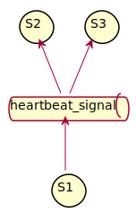
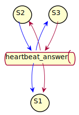
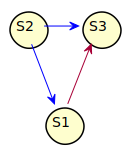
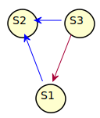
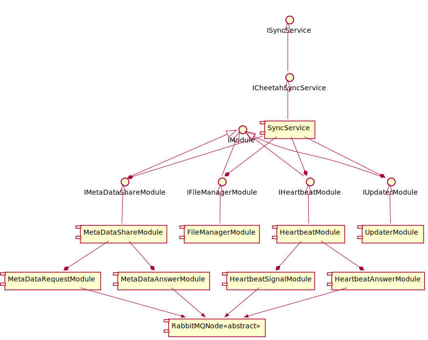
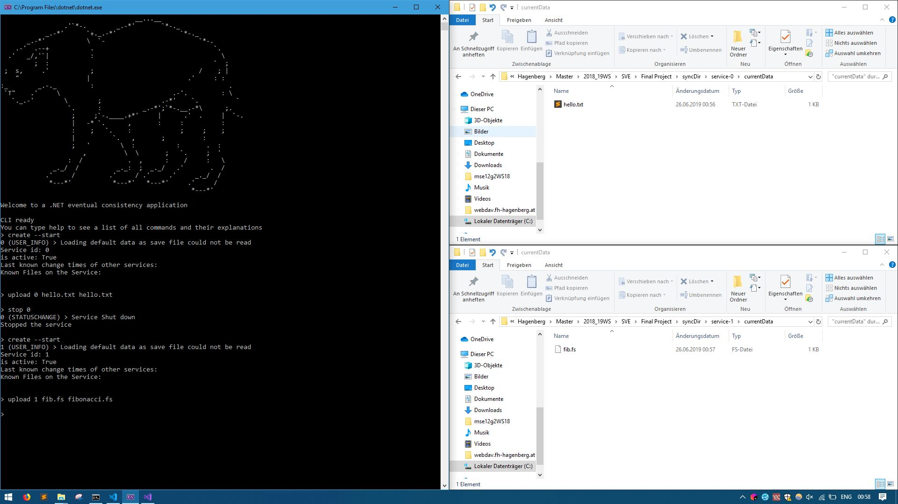
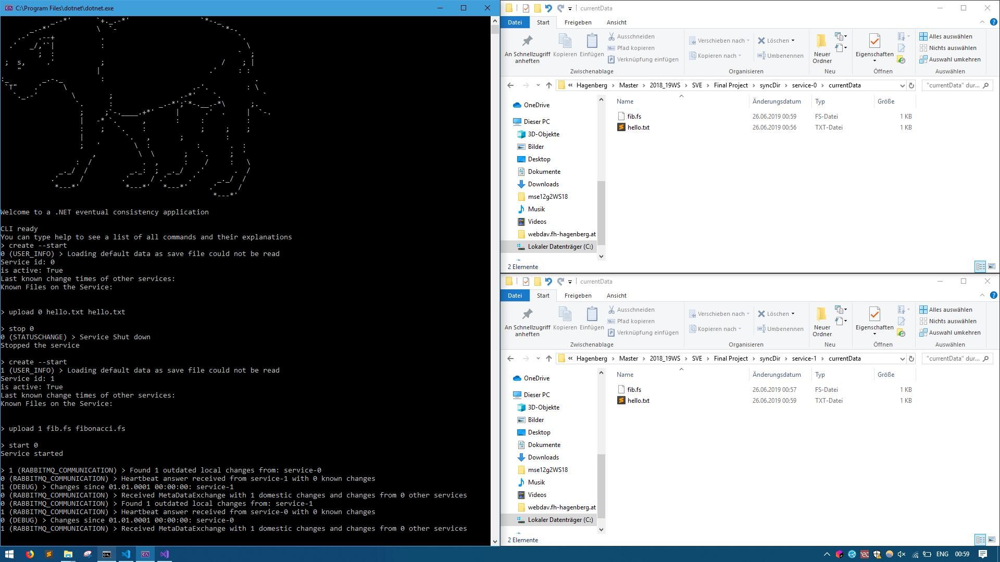
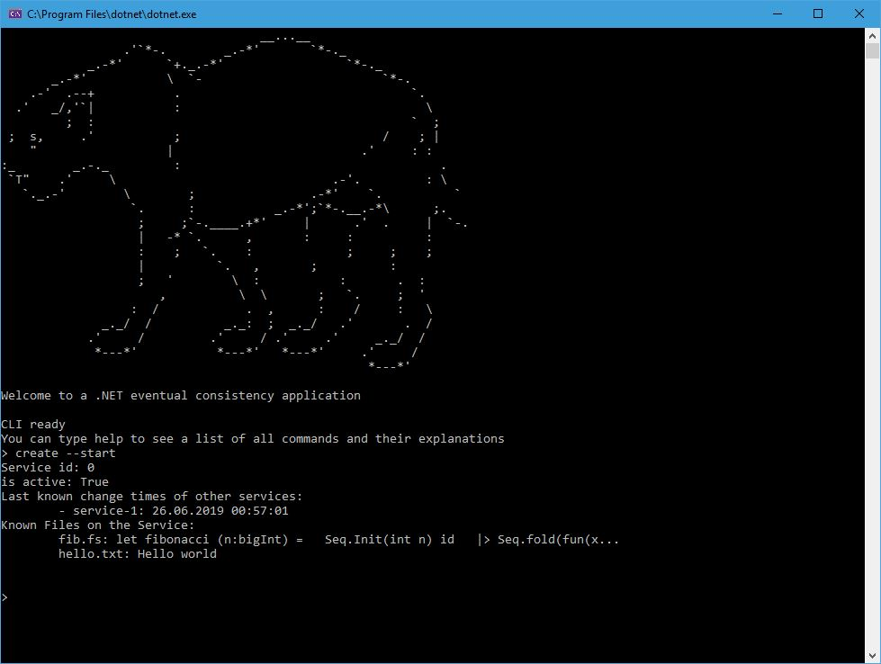

# Eventual Consistency für Datein ohne zentrale Datenbank

## Vordefinierte Ziele

### Kurzbeschreibung

Für die letzte Aufgabe, haben Mysliwietz Florian und ich ein System
entwickelt, in dem beliebig viele Services miteinander kommunizieren
und einen Integer-Wert synchronisieren.
In diesem Projekt wird das nun ausgebaut und es werden Dateien
synchronisiert.

Das Projekt ist eine Demo einer AP-Datenverwaltung
(im Sinne des [CAP Theorems](https://en.wikipedia.org/wiki/CAP_theorem)):
Es gibt allerdings auch keine zentrale Datenbank.
Stattdessen speichert jeder Service seine eigene Daten und all jene,
von denen er weiß, dass es andere Services haben.
Diese Informationen werden regelmäßig zwischen allen aktiven Services
ausgetauscht.

Siehe [Eventual Consistency](https://en.wikipedia.org/wiki/Eventual_consistency).

### Ziel/erwartetes Ergebnis

Man soll auf zwei Services Dateien hochladen können und nach einer
gewissen Zeit, sollen beide Dateien auf beiden Services zur Verfügung
stehen.
Dasselbe soll gelten für Löschen und Ändern von Dateien.
Das Zusammenführen von verschiedenen Änderungen wird allerdings nicht
behandelt.
Stattdessen wird immer der neuste Inhalt verwendet.

### Eingesetzte Technologien

- .NET Core 2.1
- [RabbitMQ](https://www.rabbitmq.com/)
- NuGet Package: RabbitMQ.Client 5.1.0

## Getting started

Um diese Anwendung zu starten, muss natürlich zuerst 
[RabbitMQ](https://www.rabbitmq.com/download.html) installiert werden.
Dann kann einfach das Skript `start.bat` ausgeführt werden, welches
den ([Cheetah](#cheetah-simulator)) ausführt.

In dieser Konsolenanwendung sollte die Bedienung sehr gut erklärt sein.
Um informationen über die verschiedenen Befehle zu erhalten, kann
einfach das Kommando `help` ausgeführt werden.
Genauere Details werden in dem Kapitel
[Cheetah (Simulator)](#cheetah-simulator) genauer behandelt.

## Theorie

### Anwendungsfall

Der Anwendungsfall, den diese Simulation nachahmen will, ist der
folgende:
Es gibt in einem Netzwerk meherere Computer.
Diese sind nicht zwingend immer an.
Allerdings soll trotzdem ein Ordner mit Dateien synchronisiert
werden, ohne, dass dafür ein zentraler Server notwendig ist.

Das ist zum Beispiel praktisch, wenn man als Privatperson mehrere
Computer besitzt, allerdings keinen Server betreiben will.
Es gibt dafür auch bereits eine sehr beliebte und gut funktioniernde
OpenSource Anwendung: [Syncthing](https://syncthing.net/)
Natürlich muss dennoch irgendein Netzwerk bestehen, in dem diese
Computer kommunizieren können.
Für Syncthing ist das ein LAN, für diese Simulation ist das
RabbitMQ.

Diese Simulation ist daher nur zur Erforschung dieses Konzeptes gedacht.

### AP - Verfügbarkeit und Partitionstoleranz

Wie zuvor angesprochen handelt es sich bei dieser Simulation
um eine AP-Datenverwaltung.
Die hohe Verfügbarkeit wird dadurch gewährleistet, dass jeder Service
eine Kopie der Änderungen besitzt.
Die Partitionstoleranz entsteht dadurch, dass beliebig viele Services
gleichzeitig laufen können und während der Laufzeit beliebig
gestarted und gestoppt werden können.

### Ablauf der Datensynchronisation

Die Datenübertragung geschieht über 3 Schritte:

- Heartbeat
- Metadatenübertragung
- Dateiübertragung

Im Heartbeat wird zuerst kommuniziert, welche Services existieren und
was deren Stand ist.
Dieser Heartbeat ist immer ein broadcast.

Nach dem heartbeat überprüft dann jeder Server, ob er einen veralteten
Stand hat.
Wenn ja, fragt er bei den anderen Services direkt an, um sie um deren
Metadaten zu bitten.
Diese werden nun direkt von Service zu Service ausgetauscht.
Sollte ein Service nach dem Heartbeat heruntergefahren werden, so ist
das den anderen Services dennoch egal – die Änderungen auf diesem
Server werden halt nicht synchronisiert.

Zum Schluss werden dann, je nach den Änderungen, auch die eigentlichen
Dateien ausgetauscht.
Das sollte über FTP funktionieren.
Da dieses allerdings schwer in einer automatischen Art aufzusetzen war,
wird dieser Teil ebenfalls nur simuliert, in dem einfach direkt auf das
Dateisystem zugegriffen wird.

Im folgenden wird dieser gesamte Ablauf anhand einem Beispiel mit
drei Services durchgegangen.

#### Beispielhafter Ablauf

In diesem Beispiel gibt es die drei Services `S1`, `S2` und `S3`,
sowie den RabbitMQ-Broker.
Natürlich haben alle Services ihre eigenen Queues, um sich auf die
Exchanges zu binden.

<p align="center">
  
</p>

Nun möchte `S1` die Änderungen abfragen.
Dafür sendet es zuerst das Heartbeat Signal.
In diesem Signal sendet es auch die neusten Zeitstempel mit, die es
von jedem Service hat.

<p align="center">
  
</p>

Danach antwortet jeder Service wieder mit einem broadcast.
Dieser beinhaltet alle Zeitstempel von Änderungen, die jünger sind
als die, die im ursprünglichen Signal mitgeschickt wurden.

<p align="center">
  
</p>

Dadurch weiß nun jeder Service, ob er gewisse Änderungen noch nicht
hat.
In diesem Fall hat `S2` noch Änderungen noch nicht, die `S1` und `S3`
bereits haben.
Zusätzlich hat `S1` auch Änderungen noch nicht, die `S3` bereits hat.

Nun werden direkte Anfragen nach den Metadaten abgeschickt.

<p align="center">
  
</p>

Jeder Service antworted nun auf diese Requests mit den ihm zur Verfügung
stehenden Metadaten.

<p align="center">
  
</p>

Sollte in diesem Schritt zum Beispiel `S3` nicht mehr antworten, dann
wird `S2` dennoch seine Daten mit dem Stand von `S1` auffrischen, auch,
obwohl dieser nicht mehr aktuell ist (sondern nur `S3` den aktuellsten
gehabt hat).

## Komponenten

### SyncService

In dem Projekt `SyncService` gibt es eine gleichnamige Klasse, die den
Service darstellt.
Da die Aufgaben von diesem Service allerdings sehr vielzählig sind, wurde
jede Aufgabe noch einmal abstrahiert.
Diese Teile wurden Module genannt.

<p align="center">
  
</p>

Die Verschiedenen Module können auch untermodule haben:

- `HeartbeatModule`: Verschickt und empfängt Heartbeat Signale
  und Antworten
  - `HeartbeatSignalModule`: Verschickt und empfängt Heartbeat
    Signale.
  - `HeartbeatAnswerModule`: Verschickt und empfängt Heartbeat
    Anworten
- `MetaDataShareModule`: Verschickt um empfängt Metadaten Anfragen
  und Antworten.
  - `MetaDataRequestModule`: Verschickt um empfängt Metadaten Anfragen
  - `MetaDataAnswerModule`: Verschickt um empfängt Metadaten Antworten
- `FileManagerModule`: Wendet die Änderungen an. Dazu gehört auch
  das Anfragen an die vollständigen Dateiinhalte.
- `UpdaterModule`: Damit nicht immer sofort Heartbeats geschickt
  werden, debounced dieses Module die Methode zum Senden davon.

`RabbitMQNode` ist eine abstracte Klasse, die die Kommunikation
über RabbitMQ erleichtert.

Generell funktioniert die Kommunikation vom Service zu den Modulen
nur über Aufruf derer Methoden, und durch das mitgeben von Methoden
an übergeordnete Funktionen.
Die Module kommunizieren mit hingegen nur mittels Events hinauf.

Der `SyncService` initialisiert und verwendet dann nur mehr lediglich
diese Module.
Weiters kümmert es sich auch selber um die Persistierung der Metadaten.

### Cheetah (Simulator)

Der Cheetah hat zwei besondere Aufgaben: Zum einen erstellt,
stoppt und verwaltet er die Services und gibt ihnen die IDs und
die Ordnerpfade, in denen sie operieren dürfen.
Zum anderen lässt er den Benutzer über ein CLI die einzelnen
Services manipulieren und zeigt deren Logs an.

Die Befehle, die unterstützt werden, können mit dem `help`-Befehl
aufgelistet werden:

```sh
> help
help: Prints this help screen.
        help <cmd> will only print the help screen for that command

exit: Stops all applications and exits the CLI
        Aliases: shutdown

create: Creates a new service
        Option --start will also start them
        Usage: create [--start]

start: Start an already existing service and its client
        Usage: start <serviceID>

stop: Stops a service and his client
        Usage: stop <serviceID>

abort: Aborts a service without giving him a chance to persist etc.
        Usage: abort <serviceID>

list: Lists all Services
        Option --running will only list running services
        Usage: list [--running]

upload: Uploads a local file to a service.
        The local file path originates from 'exampleFiles/'
        Usage: upload <serviceID> <name to upload as> <local file path>

update: Updates a file from a service with the contents of an local file.
        The local file path originates from 'exampleFiles/'
        Usage: update <serviceID> <name to upload as> <local file path>

delete: Deletes a file from a service
        Usage: delete <serviceID> <fileName>

hide: Hides Logs of the given output level or reason
        Usage: hide reason <reason>
               hide level <level>

show: Shows Logs of the given output level or reason again
        Usage: show reason <reason>
               show level <level>
```

### Namenserklärung

Unser Simulator trägt den Namen **Cheetah** (Gepard).
Das ist auf die Tatsache zurückzuführen, dass dieser eine Übersicht
über alle verfügbaren Services erhält und Einsicht auf deren internen
Berechnungen und Aufzeichnungen gewährt.
Aus diesem Grund schummelt (Homophon: *Cheater*) er im Bezug auf
tatsächliches Wissen in einer verteilten Applikation.
Außerdem jagt und fordert er unsere Message Oriented Middleware *RabbitMQ*.

### Beispiel Demo-Lauf

Dieser Demo-Lauf geht von einem blanken Zustand aus
(d.h. die Ordner `database` und `syncDir` sind gelöscht worden).
Das ist der Fall, wenn die Daten direkt aus dem Repository geklont
wurden.

Zuerst werden zwei Services erstellt.
Diese erhalten automatisch die IDs 0 und 1.
Auf diese werden nun auch zwei Dateien hochgeladen:

- `hello.txt` auf Service 0 und
- `fib.fs` aus der Datei `fibonacci.fs` auf Service 1.

> Der Service 0 wurde gestoppt bevor der Service 1 gestartet wurde.
> Das wurde daher gemacht, da Services beim Starten sofort eine
> Heartbeat-Signal schicken und sich daher sofort synchronisiert
> hätten.

```sh
> create --start
> upload 0 hello.txt hello.txt
> stop 0
> create --start
> upload 1 fib.fs fibonacci.fs
```

<p align="center">
  
</p>

Wenn nun der Service 0 wieder gestartet wird, wird dieser sofort
ein Heartbeat-Signal aussenden und sich sofort auf den neusten
Stand bringen.
Service 1 hingegen erfährt auch, dass er nicht alle aktuellen Daten
hat, und wird sich nach ca. 10 Sekunden ebenfalls synchronisieren.

```sh
> start 0
```

<p align="center">
  
</p>

Wenn nun die Applikation wieder verlassen (am Besten mit dem Befehl
`exit`), und danach neu gestartet wird, dann haben beide Services
wieder ihren alten Stand.
(Sie müssen dennoch der Reihe nach mit `create` erstellt werden)

```sh
> create --start
```

<p align="center">
  
</p>

## Quellen

Diese Quellen sind noch hauptsächlich von der alten Demo, in der
nur Views als integer umhergeschickt wurden.
Sie sind allerdings dennoch noch (entfernter) relevant:

- [RabbitMQ](https://www.rabbitmq.com/getstarted.html)
- [Why Computers Can't Count Sometimes](https://www.youtube.com/watch?v=RY_2gElt3SA)
- [Embracing eventual consistency in SoA networking](https://blog.envoyproxy.io/embracing-eventual-consistency-in-soa-networking-32a5ee5d443d)
- [Messaging as a programming model Part 2](https://eventuallyconsistent.net/2013/08/14/messaging-as-a-programming-model-part-2/)
- [Eventual vs Strong Consistency in Distributed Databases](https://hackernoon.com/eventual-vs-strong-consistency-in-distributed-databases-282fdad37cf7)
