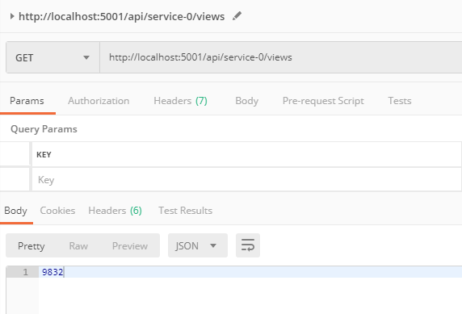
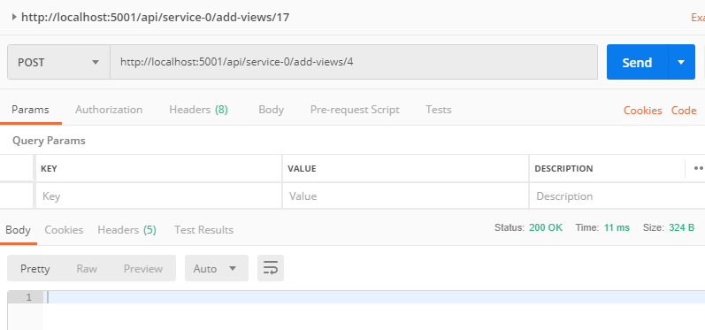
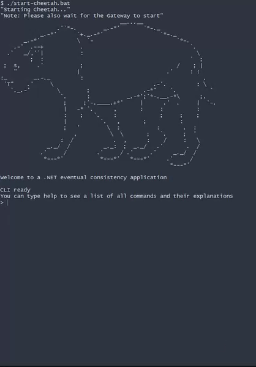
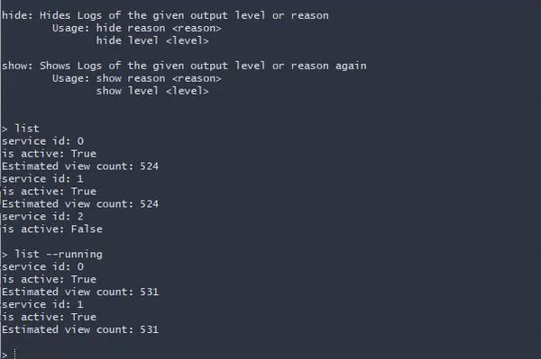

# Eventual Consistency

## Vordefinierte Ziele

### Kurzbeschreibung

Es handelt sich um eine Deme einer AP-Datenverwaltung (im Sinne des [CAP Theorems](https://en.wikipedia.org/wiki/CAP_theorem)):
Mehrere Clients generieren 'Views' (vergleiche Views mit YouTube oder Likes in Sozialen Medien) auf verschiedene Services. Diese liegen bewusst getrennt vor.
Services sollen so miteinander kommunizieren, dass diese zumindest nach einer gewissen Zeit auf denselben Stand kommen.

Siehe [Eventual Consistency](https://en.wikipedia.org/wiki/Eventual_consistency).

### Ziel/erwartetes Ergebnis

Mindestens zwei Services, die miteinander kommunizieren und ihre Daten (asynchron) synchronisieren wollen.
Diese werden von einem eigenen Simulator verwaltet und bestimmt.

Kommunikation zwischen den Services soll durch künstliche Komplikationen auf ihre Stabilität geprüft werden.

### Eingesetzte Technologien

- .NET Core 2.1
- RabbitMQ
- ASP.NET
- NuGet Package: RabbitMQ.Client 5.1.0

### Vorgehensweise

Im ersten Schritt berieten wir uns ausführlicher darüber, wie wir die Applikation aufbauen wollen. Das Architektur-Design der einzelnen Komponenten wurde mehrmals überarbeitet,  um verschiedene Aspekte des Prinzips anwenden zu können. Schwierig war dabei die Entscheidung, wie viel wir über einen Rest-Client steuern möchten und wie viel über einen dezidierten Simulator laufen soll. Am Ende war das ASP.NET-Rest-Modul zuerst funktionierend, weshalb erste Tests hier durchgeführt wurden.

Je weiter die Implementierung des Simulators fortgeschritten war, desto mehr wurde dieser in der Entwicklung  verwendet, vor allem weil er bessere Konsolen-Outputs liefert und schneller und angenehmer verwendet werden kann.

Nachdem die Interfaces einigermaßen fixiert waren, konnte die Arbeit relativ getrennt aufgeteilt und am Ende die Applikation überraschend gut  zusammengeführt werden.

## Theorie

Zahlen addieren sollte für einen Computer grundsätzlich kein Problem darstellen. Wenn das aber verteilt und skalierbar durchgeführt werden muss, kommt man auf einige interessante Probleme oder Nebeneffekte, die hier in kurz dargestellt werden:

- Race conditions
    - Zwei Clients können zu gleichen Zeit eine Abfrage von Daten machen. Durch die interne Request-Reihenfolge könnte ein Update am Server zwischen den Abfragen die Ergebnisse beeinflussen. Man kann kaum festlegen, welcher Client zuerst beliefert wird.
    - Durch Balance-Loaders können Clients zu verschiedenen Servern (hier: Services) weitergeleitet werden, die unterschiedliche Ergebnisse liefern können.

- Caching
    - Wenn es mehrere Caching-Instanzen gibt, können Clients verschiedene Ergebnisse bekommen, je nachdem, wo sie hingeleitet werden.
- Eventual  Consistency
    - Man nimmt in Kauf, dass Server nicht immer absolut aktuelle Daten liefern. Sie sollen in einem Moment mit einer Abweichung stimmen und erst nach einer gewissen Zeitspanne zum korrekten Ergebnis kommen.

In diesem Projekt behandeln wir vor allem Eventual Consistency, die anderen Themen spielen aber trotzdem eine Rolle.


### AP - Verfügbarkeit und Partitionstoleranz 

Die Verfügbarkeit ist extrem hoch, ebenso Toleranz gegenüber dem Ausfall einzelner Server. Allerdings ist die Konsistenz nicht immer sofort gegeben: es kann durchaus eine längere Zeit dauern, bis alle Server Updates erhalten und damit von allen Clients gesehen wird. (Stichwort: horizontale Skalierunng)


Beispiele für Web-Anwendungen, die nicht auf strenge Konsistenz angewiesen sind, wären Social-Media-Sites wie Twitter oder Facebook; wenn einzelne Nachrichten nicht bei allen Nutzern  gleichzeitig eintreffen, ist dadurch die prinzipielle Funktion des Dienstes nicht beeinträchtigt. 

Allerdings darf selbst bei diesen Applikationen keine Anfrage verloren gehen, wenn man beispielsweise and YouTube  denkt, wo Werbeeinnahmen aufgrund von der Anzahl ann Videoaufrufen generiert werden.


## Komponenten

### Gateway

Das Gateway ist eine ASP.Net-Anwendung, die eine Rest-Schnittstelle zu den ViewServices darstellt. Hier können Views ausgelesen und neue hinzugefügt werden.

Die Kommunikation mit den Services erfolgt über RabbitMQ mit dem Request/Reply-Pattern (Implementierung in `RPCGatewayClient`).


Die definierten Routen sind folgende:

- `GET api/{serviceUid}/views`
- `POST api/{serviceUid}/add-view`
- `POST api/{serviceUid}/add-views/{number}`

Wie man hier erkennen kann, wird eine Anfrage immer an genau ein vordefiniertes  Service geschickt. In der Realität würde ein Load-Balancer eine Anfrage entgegennehmen und diese an einen Service weiterleiten (z.B.: an einen unausgelasteten oder jenen in der Nähe des Requests).


#### Screenshots






#### Herausforderungen

- SSL-Konfiguration und Port-Blocking
- Gemeinsames Starten von Simulator und ASP.NET


### Cheetah (Simulator)


Der Simulator hat hier zwei besondere Aufgaben: Zum einen erstellt, stoppt und verwaltet er definierte Services und gibt Ihnen IDs. Zum anderen lässt er das manuelle und automatische Hinzufügen und simulieren von Client-Views zu.

Das Ganze funktioniert über ein CLI, das all diese Möglichkeiten bietet.

```bash
> help
help: Prints this help screen.
        help <cmd> will only print the help screen for that command

exit: Stops all applications and exits the CLI
        Aliases: shutdown

create: Creates a new service and a client for it
        Option --start will also start them
        Usage: create [--start]

start: Start an already existing service and its client
        Usage: start <serviceID>

stop: Stops a service and his client
        Usage: stop <serviceID>

abort: Aborts a service without giving him a chance to persist etc.
        Usage: abort <serviceID>

send: Sends views to the service
        Usage: send <serviceID> [<viewAmount>]

periodic: Asks the client to start or stop sending periodic views to the service
        Usage: periodic start <serviceID> <interval in milliseconds> [<viewAmount>]
               periodic stop <serviceID>

list: Lists all Services
        Option --running will only list running services
        Usage: list [--running]

hide: Hides Logs of the given output level or reason
        Usage: hide reason <reason>
               hide level <level>

show: Shows Logs of the given output level or reason again
        Usage: show reason <reason>
               show level <level>
```


Wie man hier erkennen kann,  hat dieses CLI bereits den Bequemlichkeit-Status erreicht. Es bietet gute Erklärungen und liefert stets saubere Fehlermeldungen zurück.





Beispiel eines Demo-Laufs:

Services werden gestartet und periodisch simulierte Views werden abgegeben. Die Logging-Ausgaben können in verschiedenen Stufen angezeigt werden. Hier sieht man beispielsweise, welche Services wann synchronisieren und Synchronisierungen empfangen und welche Daten verschickt werden.

```
# create and start 3 services
> create --start
> create --start
> create --start

# define automated periodic client requests
> periodic start 0 3000 5
> periodic start 1 5000 2

# stop service 2
> stop 2

# begin of gif
> list
> list --running

> show reason DEBUG
```





#### Namenserklärung

Unser Simulator trägt den Namen **Cheetah** (Gepard). Das ist auf die Tatsache zurückzuführen, dass dieser eine Übersicht über alle verfügbaren Services erhält und Einsicht auf deren internen Berechnungen und Aufzeichnungen gewährt. Aus diesem Grund schummelt (Homophon: *Cheater*) er im Bezug auf tatsächliches Wissen in einer Applikation mit Eventual Consistency. Außerdem jagt und fordert er unsere Message Oriented Middleware *RabbitMQ*.


### ViewService

Das Kernstück des Projektes stellt der  View-Service dar. Das ist jener Service der mehrfach verteilt gestartet und angesprochen wird und lokale Daten mit den anderen View-Services synchronisiert.


#### Interface

```c#
public interface IViewService
{
    void StartUp(string uid, string contextPath);
    void ShutDown();
    void Abort();
    int GetViewCount();
    void AddViews(int number = 1);
    bool IsRunning();
}
```


Außerdem beinhaltet die Implementierung eine einfache Persistierung, die alle wissenden Views von allen Services vorm Synchronisieren und beim Shutdown serialisiert in einer Datei ablegt. Beim Startup wird nachgeschaut, ob diese Datei existiert und gegebenenfalls mit diesem Zustand weitergemacht.

Intern werden die Views in einem `ViewDataObject` gespeichert, das die eigenen Views und die Views von anderen synchronisierten Services mitspeichert. Hier kann dann die totale Anzahl der Views berechnet werden.


#### Synchronisierung

Die Synchronisierung zwischen den Services wird mit dem Publish/Subscribe-Pattern über *RabbitMQ* durchgeführt.

Dabei erfolgt ein Update nach einem gewissen Intervall ausgelöst innerhalb des Services.

Pro View-Service gibt es eine Queue und über einen `ChannelExchangeName` wird ein Fanout durchgeführt (*Publish*). Außerdem erfolgt ein *Subscribe* auf dem gleichen ExchangeName.


Übertragen wird hier nur der eigene (sichere) View-Count, man könnte allerdings die Logik auch erweitern und aufgrund von anderen - möglicherweise ungültigen oder abgelaufenen - Daten synchronisieren. Dabei muss man aber sicherlich Timestamps,  etc. mitliefern, um die Richtigkeit zu maximieren. Unsere Lösung wird demnach immer etwas hinter den echten absoluten Werten nachhinken und erst konsistent werden, wenn die Anzahl der einkommenden Anfragen überschaubar sinkt. Sobald alle Services das nächste Mal ein Update ausgesendet haben, sollte jeder Service die richtigen absoluten Views liefern können.


## Quellen

- [Why Computers Can't Count Sometimes](https://www.youtube.com/watch?v=RY_2gElt3SA)
- [Embracing eventual consistency in SoA networking](https://blog.envoyproxy.io/embracing-eventual-consistency-in-soa-networking-32a5ee5d443d)
- [Messaging as a programming model Part 2](https://eventuallyconsistent.net/2013/08/14/messaging-as-a-programming-model-part-2/)
- [Eventually consistent](https://eventuallyconsistent.net/tag/c/)
- [Eventual vs Strong Consistency in Distributed Databases](https://hackernoon.com/eventual-vs-strong-consistency-in-distributed-databases-282fdad37cf7)
